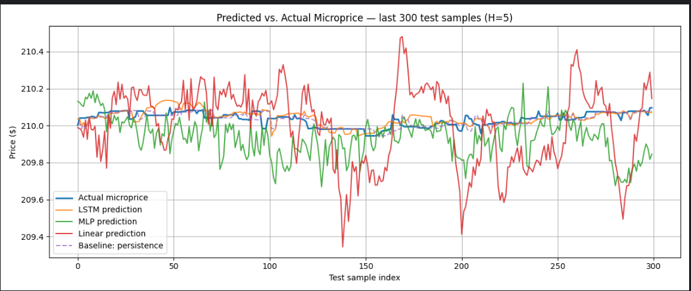

# Microprice forecasting

## Multi-level microprice

The top of the book microprice is a concept discussed in a paper by Sasha Stoikov, and the book Algorithmic and High Frequency Trading by Cartea et al., which resembles a better estimate of the fair value of an asset than its midprice, which is a low frequency trading signal. My main interest in the microprice is in the context of market making, as the MM is trying to find a fair value, around which he wants to place his bid and ask prices.
Here, I extended this concept such that it uses multiple levels of LOB data, making it a more robust estimate of the fair value.

Consider the following example:
ask @ 101$/1000 shares,   bid @ 100$/10 shares. When using the traditional microprice, you would skew your prices towards the bid price, as there is higher pressure to sell  (microprice would be =100.01$).
But what if there is a large volume available at the 2nd best bid @ 99$/ 1M shares? 
That scenario isn't considered by the top of the book microprice, but in my extension with an exponential weighting scheme.

The first idea would be to just sum all bid volumes and all ask volumes and calculate the microprice as for the top of the book microprice, but this is flawed, as the 2nd best bid could be far away from the best bid, and thus equal weighting is unrealistic. I propose to have an exponential decay for the weighting, the further away your bids are from the best bid, as well as the asks from your best ask. Also, the volume will be weighted with this distance-based scheme.
This new feature introduces two possible parameters to optimize: the number of levels you consider for the multi-level microprice and also the decay rate alpha. 
This also introduces the concept of a multi-level order imbalance on the fly, as the microprice can be written as a function of the midprice, spread and order book imbalance.

## Machine Learning models and data preparation
For the preprocessing, I added the features spread and multi-level order book imbalance to the LOB data set. Then I applied fractionally differentiation, to make it stationary, but with minimal memory loss, as proposed by Marcos Lopez de Prado in his book Advances in Financial Machine Learning. This improved the performance of the algorithm compared to not using it.

I tried 3 different models, LSTM, linear regression and MLP with ReLU hidden layers. LSTM performed best and beat the baseline models, which were just taking the previous time steps mid price or previous time steps microprice as the prediction. The other ML models didn't beat the baseline models.

## Forecasting results
The label is the microprice 5 time steps in the future, given the last 20 time steps of the LOB data. As can be seen in the plot, the LSTM performed best.

